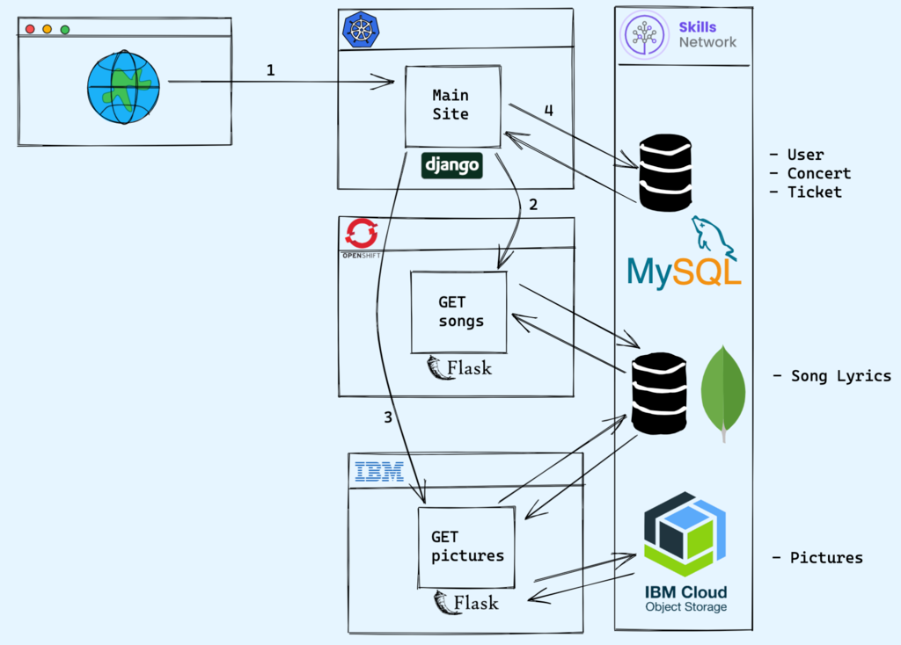

# Project Architechture

# Lab
1.  Clone git repo: `git clone https://github.com/ibm-developer-skills-network/Back-end-Development-Capstone.git`
2.  Get into the directory by `cd Back-end-Development-Capstone`
3.  Get into Django code `cd djangoserver`
4.  Install requirements `pip install -r requirements.txt`
5.  Run the server `python manage.py runserver`
6.  It will tell you that you have unapplied migrations.

    **Migrations** are Django’s way of propagating changes you make to your models (adding a field, deleting a model, etc.) into your database schema. They’re designed to be mostly automatic, but you’ll need to know when to make migrations, when to run them, and the common problems you might run into. There are several commands which you will use to interact with migrations and Django’s handling of database schema:

    1. **_migrate_**, which is responsible for applying and unapplying migrations.
    2. **_makemigrations_**, which is responsible for creating new migrations based on the changes you have made to your models.
    3. **_sqlmigrate_**, which displays the SQL statements for a migration.
    4. **_showmigrations_**, which lists a project’s migrations and their status.

7.  Create the initial migrations and generate the database schema:

    ```shell
    python manage.py makemigrations
    python manage.py migrate
    ```

8.  Run server successfully this time: `python manage.py runserver`
9.  Launch Application
10. Click on Songs and Photos
11. Click on Concerts, no existing Concert present
12. Let's create admin user `python manage.py createsuperuser`
    1. Username: `admin`
    2. Email address: _leave blank, simply press enter_
    3. Password: Your choice, or simply `qwerty123`
13. Run the server again `python manage.py runserver` and goto admin: `http://localhost:8000/admin/`
14. Enter the admin user details you created in previous step.
15. Now you are in the admin section built by Django.

    One of the most powerful parts of Django is the **automatic admin interface**. It reads metadata from your models to provide a quick, model-centric interface where trusted users can manage content on your site. The admin’s recommended use is limited to an organization’s internal management tool. It’s not intended for building your entire front end around.

16. Add a Concert:
    1. Concert name: `Coachella 2023`
    2. Duration: `72`
    3. City: `Indio, California`
    4. Date: `2023-04-14`
17. Click on `View Site` meny at the top
18. Now if you visit `Concerts`, you will see Coachella listed.
19. Our Django application is now running, but Songs and Photos are hard coded.
20. Open `concert\views.py`
21. See `songs` and `photos` definition.

    1. Retrieve `songs` from a REST endpoint by replacing the code with following:

    ```python
    songs = req.get(
        "https://raw.githubusercontent.com/captainfedoraskillup/private-get-songs/main/backend/data/songs.json").json()
    return render(request, "songs.html", {"songs": songs})
    ```

    2. Retrieve `photos` from a REST endpoint by replacing the code with following:

    ```python
    photos = req.get(
        "https://raw.githubusercontent.com/captainfedoraskillup/private-get-pictures/main/backend/data/pictures.json").json()
    return render(request, "photos.html", {"photos": photos})
    ```

22. Verify Songs and Photos changes. Visit the Songs section, you will see a longer list of songs, clicking on each will show its Lyrics in a modal dialog. While going into Photos, you will see more than two.
23. Now back to Concerts, click on the concert Coachella we created. You will see an RSVP page.
24. RSVP Page shows you details of the Concert along with an option to either: Attend, Not Attend or no Option `-`.
25. If you open `concert_detail.html`, you will see an html form:

        ```html
                <form action="" method="POST">
                
                <input
                  name="concert_id"
                  type="number"
                  value="{{concert_details.id}}"
                  hidden="hidden"
                />
                <div class="input-group mb-3">
                  <label class="input-group-text" for="attendee_choice">RSVP</label>
                  <select class="form-select" name="attendee_choice" required>
                    
                      <option selected  value="{{ attending_choice.0 }}">{{ attending_choice.1 }}</option>
                    
                  </select>
                </div>
                <input type="submit" class="btn btn-primary" />
              </form>
        ```

26. On `Submit` of this form, the details are sent to `concert_attendee` in `concert\views.py`.
27. It does two validations:
    `if request.user.is_authenticated:` means whether the user is authenticated. Because anonymous users are not allowed to RSVP.
    Then `if request.method == "POST":` to check whether it is an `HTTP POST` event.
28. From the `body` of the `POST` method, it takes `concert_id` and `attendee_choice`.
29. Then it checks, whether a selection was made previously, if yes, then update it. Otherwise insert new selection the databaes for this user.
30. Finally, redirect the user.

## Cleanup while testing

```shell
find . -path "*/migrations/*.py" -not -name "__init__.py" -delete
find . -path "*/migrations/*.pyc"  -delete
find . -path "*/db.sqlite3"  -delete
python manage.py makemigrations
python manage.py migrate
python manage.py runserver
```

##  To move the data from SQLite to MySQL

Execute:

`python manage.py dumpdata > datadump.json`

Next, change your `settings.py` to the mysql database.

Finally:

`python manage.py loaddata datadump.json`

##  Containerize the application
1. build a docker image
    ```
    docker build . -t concert
    ```
1. tag docker image with the correct registry information
    ```
    docker tag concert captainfedora/concert:v1
    ```
    The above command tags to `captainfedora` repository on dockerhub with the image name of `concert` and label of `v1`

1. Run the docker image to validate everything is working
    ```
    docker run -p 8000:8000 captainfedora/concert:v1
    ```
